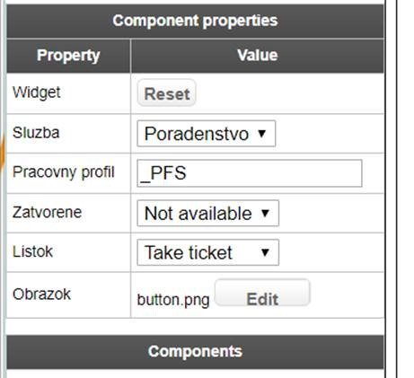

# Service Point Status Button
Widget for Qmatic Orchestra platform

## Description
Creates simple button which will create visit for selected service or displays selected page. This button is used
in cases when you need to create visit (print ticket) if there is open Service Point with defined Work Profile. If there is no open Service Point with defined Work Profile, system will display selected page.

## Install
Clone or download repository and run
`npm install`

## Build
Run Gulp to build final code:
`gulp build`
or if you don't Gulp globally and have NPX:
`npx gulp build`

Create ZIP file from files in build folder and change extension to .wgt

## Usage
Upload new widget to Orchestra system and assign unit types (Touchscreen - Intro and Generic). Add widget to your surface and configure it.

Property | Type | Description
--- | --- | ---
Service | service | Click on the button creates visit for this service
Work Profile Lookup | string | Script will look up for this string in name of work profile.
Closed | page | Show this page when there is no open workstation with profile which match WP lookup
Take ticket | page | Show this page if there is open workstation. For example> Take ticket.
Image | image | Image for this button.

For more questions or if you want to participate, contact me at Twitter: @starosta83
